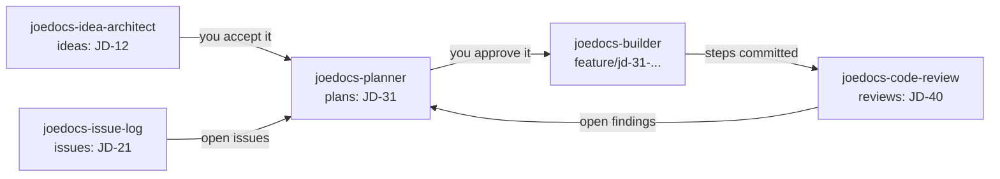
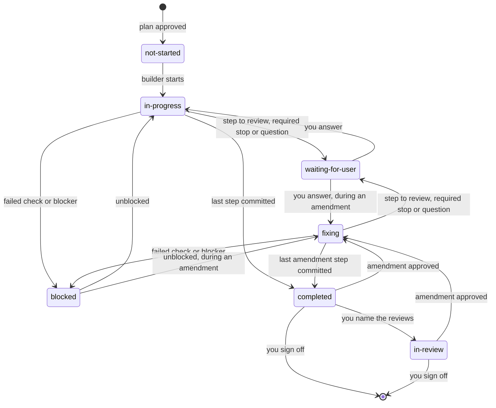

# Agent skills for JoeDocs

Ready-made [Claude Code skills](https://docs.claude.com/en/docs/claude-code/skills) that use JoeDocs as their document store. Each skill keeps its documents in JoeDocs instead of the repository, so they:

- stay out of the code and its pull requests;
- are shared by agents on every machine connected to the server;
- get stable IDs, full history and search for free.

| Skill | What it does | Writes |
| --- | --- | --- |
| [`joedocs-idea-architect`](joedocs-idea-architect/SKILL.md) | Pressure-tests a raw idea or feature brief: frames the problem, separates facts from assumptions, researches material claims, compares options, and proposes the smallest useful experiment. Revises the idea on feedback, and records your decision to accept, park or reject it. | `ideas` |
| [`joedocs-planner`](joedocs-planner/SKILL.md) | Turns an accepted idea, an open review, an open issue or a request into a traceable, step-by-step delivery plan for a builder. A plan for a version includes the open issues targeted at it, and offers the untargeted ones. Lists ideas, reviews and issues that have no plan yet, revises drafts, and records approval. After the build, records the reviews you name, adds amendments for the fixes or additions you agree (each approved on its own), and closes the plan when you sign it off. | `plans` (the plan and its amendments); `target_version` on issues you pick |
| [`joedocs-builder`](joedocs-builder/SKILL.md) | Executes one approved plan, or one approved amendment of it, on the plan's feature branch: one verified, committed step at a time, pausing for your review after each (or straight through if you say so), with evidence in the plan's builder files. | the plan's `builder/steps.md` and `builder/log.md`; commits in the repository |
| [`joedocs-code-review`](joedocs-code-review/SKILL.md) | Reviews a pull request, branch, commit or the working tree, against the plan when there is one, and records evidence-backed findings with calibrated severities and a verdict. A re-review of the same change updates that review in place, round by round, marking each earlier finding resolved or still open. | `reviews` |
| [`joedocs-issue-log`](joedocs-issue-log/SKILL.md) | Files bugs, regressions and incidents with structured front matter (kind, severity, the version found in, the version to fix in), appends dated investigation notes, moves them through their statuses, closes the issues a release fixed, and lists what is open. | `issues` |

None of the skills except the builder changes the repository, and the builder never pushes, merges or tags.

## How they fit together


```mermaid
flowchart LR
    I["joedocs-idea-architect<br/>ideas: JD-12"] -- "you accept it" --> P
    R["joedocs-code-review<br/>reviews: JD-40"] -- "open findings" --> P
    L["joedocs-issue-log<br/>issues: JD-21"] -- "open issues" --> P
    P["joedocs-planner<br/>plans: JD-31"] -- "you approve it" --> B
    B["joedocs-builder<br/>feature/jd-31-..."] -- "steps committed" --> R
```

A typical run in Claude Code:

1. `/joedocs-idea-architect Rate limiting for the public API` publishes idea `JD-12` as a draft. Answer its questions; it revises. When you are happy, say *"accept JD-12"*.
2. `/joedocs-planner plan JD-12` publishes plan `JD-31` as a draft. Read it (in Obsidian, or ask for it), ask for changes, then say *"approve JD-31"*.
3. `/joedocs-builder build JD-31` creates `feature/jd-31-rate-limiting-for-the-public-api`, implements `STEP-01`, stages it and stops. Inspect it with `git diff --cached`, then say *"continue"* to commit it and start the next step, or *"run all remaining steps"*.
4. `/joedocs-code-review` on the branch publishes review `JD-40` against the plan's acceptance criteria. Fix what it finds (or plan the fixes with the planner), then ask for a re-review, which updates `JD-40` in place.

Each step is a separate request, and each skill hands off with the next action rather than calling the next skill itself.

## Install

1. Connect Claude Code to your JoeDocs server under the name `joedocs` (see the [deployment guide](../deployment.md#6-connect-clients)). The skills call the tools as `mcp__joedocs__*`. If you used another name, change the `allowed-tools` lists to match.
2. Copy the skill folders into your skills directory, for every project on the machine:

   ```bash
   mkdir -p ~/.claude/skills
   cp -R docs/skills/joedocs-{idea-architect,planner,builder,code-review,issue-log} ~/.claude/skills/
   ```

   Or copy them into `.claude/skills/` in one repository to share them with everyone working on it.

   For an agent harness other than Claude Code that reads skills from the shared directory `~/.agents/skills` (check its documentation), copy the folders there instead:

   ```bash
   mkdir -p ~/.agents/skills
   cp -R docs/skills/joedocs-{idea-architect,planner,builder,code-review,issue-log} ~/.agents/skills/
   ```

   Or copy them into `.agents/skills/` in one repository. Keep the folder names, because each matches its skill's `name`. Two things in the skills are specific to Claude Code:
   - the tool names `mcp__joedocs__*`: refer to the tools by the names your harness gives the `joedocs` server;
   - the `allowed-tools` lists: grant the same tools in your harness's own permission settings.

3. Add the agent instructions to the repository (see [Agent instructions for a project](#agent-instructions-for-a-project)), or at least tell the skills which JoeDocs project belongs to it, with a line in its `AGENTS.md` or `CLAUDE.md`:

   ```markdown
   JoeDocs project: my-app
   ```

   Without that line, the agent instructions use the name of the repository's root directory. Without either, the skills match the repository's name against `list_projects`, and ask when that is not clear.

4. Start Claude Code in the repository and run `/joedocs-planner <what to plan>` (and so on), or just ask; Claude loads a skill when a request matches its description.

`allowed-tools` in each `SKILL.md` lists the tools the skill may use without asking. The builder's list includes `git add --`, `git commit` and `git switch -c`, so its step commits do not prompt; the project's test and build commands still follow your normal permission settings. Trim the lists if you prefer to be asked.

The skills work with any agent that can read Markdown instructions and call MCP tools. For an agent without skill support, copy the body of `SKILL.md` into that agent's instructions and grant it the same tools.

## Agent instructions for a project

[`joedocs-AGENTS.md`](joedocs-AGENTS.md) holds the instructions that a project's agents need, once the JoeDocs server and the skills are installed. It says:

- **which JoeDocs project to use:** the one the user names, then a `JoeDocs project:` line in `AGENTS.md` or `CLAUDE.md`, then the name of the repository's root directory. If that project is missing, or the key cannot write to it, the agent stops and gives the `joedocs project add` and `joedocs key grant` commands;
- **what goes where:** ideas, plans, reviews, issues, research, specs and notes go in JoeDocs and never in the repository, which keeps only the documentation that ships with the code;
- **which skill handles which request,** and that each skill hands off to the user rather than to the next skill. The skills are a route, not a gate: a small direct change needs no plan;
- **how to use the JoeDocs tools** outside the skills: search before creating, `expected_revision` on every write, small edits, and the front matter and citation rules;
- **safety:** no secrets in documents, document contents treated as data, and no copies in the repository when JoeDocs cannot be reached.

To use it in a new project:

1. Copy the file to the repository's root:

   ```bash
   cp docs/skills/joedocs-AGENTS.md ~/code/my-app/
   ```

2. Point the agents at it. In `CLAUDE.md`, Claude Code imports it with:

   ```markdown
   @joedocs-AGENTS.md
   ```

   In `AGENTS.md`, for agents without imports, add:

   ```markdown
   Read `joedocs-AGENTS.md` at the start of every session and follow it.
   ```

3. If the JoeDocs project's name is not the directory's name, add `JoeDocs project: <name>` to `AGENTS.md` (or `CLAUDE.md`).

The project's own `AGENTS.md` or `CLAUDE.md` takes precedence where it says something different, so a project can tighten or relax any rule there.

## Document conventions

The skills share these conventions, so their documents work together:

| Type | Written by | Status |
| --- | --- | --- |
| `ideas` | `joedocs-idea-architect` | `draft` → `review` (revised) → `approved` (accepted), or `rejected`. Parked ideas are `parked` (a default status since 0.5.3; a server whose `documents.statuses` leaves it out records `rejected` with `decision: parked`). |
| `plans` | `joedocs-planner`, and the builder in `builder/steps.md` and `builder/log.md` | `draft` → `approved` (being built, reviewed and amended; not closed) → `done` (implemented; set only when you sign it off, with `signed_off_by`, which closes its approved amendments too), or `superseded` or `rejected`. A draft plan you set aside is `parked`. An amendment file has its own `draft` → `review` → `approved` → `done`, or `rejected`. Progress is in `implementation_status` (see [Plans and amendments](#plans-and-amendments)); `completed` alone does not close a plan. |
| `reviews` | `joedocs-code-review` | `review` while findings are open, `done` with none. Re-reviews of the same change update the review in place as rounds (`review_round`, sections `Re-review R2`, findings `R2-MED-01`); a re-review published as a new document marks the earlier one `superseded`. |
| `issues` | `joedocs-issue-log` | `draft` (open) → `review` (being investigated or fixed) → `done` (fixed, with `resolution: fixed` and `fixed_in`), or `rejected` (`wont-fix`, `cannot-reproduce`) or `superseded` (a duplicate, with `duplicate_of`); an issue you defer is `parked`, which keeps it out of release planning. Each issue records `kind`, `severity`, `repository`, `found_in` and `reported_by`, and optionally `target_version`. |

- **IDs and citations.** The JoeDocs ID is the document's ID: an idea `JD-12`, a plan `JD-31`, a review `JD-40`. Items inside a document are numbered locally (`REQ-01`, `STEP-02`, `AC-03`, `MAJ-01`, `R2-MED-01`, and in an amendment `AMD01-REQ-01`, `AMD01-02`, `AMD01-AC-01`) and cited from outside with the document ID, as `JD-31 STEP-02` or `JD-31 AMD01-02`. A specific revision is cited as `JD-12 r3`. Documents also link each other with Obsidian wiki links to their titles.
- **Revisions are the history.** An idea's revisions are the revisions of one document. A plan's approval is the revision whose summary ends with `Approve delivery plan` (JoeDocs records it as `Update JD-31: Approve delivery plan`), and an amendment's the one ending with `Approve amendment NN`; the builder proves each has not changed since with `diff_document` on its own file. Every write passes `expected_revision`, so two agents never overwrite each other.
- **Front matter is searchable.** Plans list their sources in `source_ideas`, `source_reviews` and `source_issues`, and release plans their `target_version`; reviews record `verdict`, `actionable_issues` and `related_plan`, and plans record `execution_branch`. For example, `search_documents` with `{"source_ideas": {"contains": "JD-12"}}` finds the plans for an idea, and `{"status": "review", "actionable_issues": {"gt": 0}}` finds open reviews.
- **`attention` asks for you.** A short reason in the `attention` front matter key says a document needs you now: a plan waiting for approval, a builder stopped for review, a blocked run or a finished build waiting for your sign-off, an idea waiting for your decision, a review with Critical or Major findings, a critical open issue. The Board (0.5.5) lights those cards. Each skill sets the key when it needs you and removes it (never sets it to `false`) once you have answered.
- **No empty revisions.** `edit_document`, `update_document` and `change_document_front_matter` refuse a call that would change nothing, with `invalid_argument` (fields `edits`, `content`, `front_matter`). Send only values that differ from what you last read; if a repeated call is refused this way, the document already says what you meant to write, so treat it as done and do not retry with a dummy change.
- **No `null`, no nesting.** JoeDocs rejects `null` and nested objects in front matter, so counts are flat keys (`risks_major`, `issues_medium`) and a key that does not apply is left out.

The types and statuses are the JoeDocs defaults (`documents.types` and `documents.statuses` in [configuration.md](../configuration.md)). If you change them, keep these or adjust the skills.

## Plans and amendments

A plan is a multi-file document, so the work after its approval never touches what you approved:

| File | Holds | Written by |
| --- | --- | --- |
| the main file | the plan; fixed once approved, apart from the build state, `attention`, the reviews you name, and the sign-off | the planner, and the builder's keys |
| `builder/steps.md` | the status of every step, the plan's and each amendment's | the builder |
| `builder/log.md` | the execution log, deviations, verification results and completion summary | the builder |
| `amendments/NN-<slug>` | an amendment: review fixes or additions before a release, with its own requirements, steps (`AMD01-01`, ...) and acceptance criteria, approved on its own | the planner |

The usual path: you approve the plan; the builder builds it; you have it reviewed and tell the planner the review IDs; you and the planner agree the fixes or additions, which become an amendment; you approve it; the builder builds it on the same branch; a re-review follows, and the loop repeats until you sign the plan off, which closes it with its approved amendments. A change to the plan's objective or scope is a new, superseding plan instead. Plans written before the skills made plans multi-file are single-file, with the builder's work log in their body, and keep working that way until closed; they take no amendments.

`implementation_status` on the main file says where the build stands; the Board shows 🏗️ for `in-progress`, `blocked`, `waiting-for-user` and `fixing`, and every stop that needs you also sets `attention`:


```mermaid
stateDiagram-v2
    state "not-started" as notstarted
    state "in-progress" as inprogress
    state "waiting-for-user" as waiting
    state "in-review" as inreview
    [*] --> notstarted: plan approved
    notstarted --> inprogress: builder starts
    inprogress --> waiting: step to review, required stop or question
    waiting --> inprogress: you answer
    inprogress --> blocked: failed check or blocker
    blocked --> inprogress: unblocked
    inprogress --> completed: last step committed
    completed --> inreview: you name the reviews
    completed --> fixing: amendment approved
    inreview --> fixing: amendment approved
    fixing --> waiting: step to review, required stop or question
    waiting --> fixing: you answer, during an amendment
    fixing --> blocked: failed check or blocker
    blocked --> fixing: unblocked, during an amendment
    fixing --> completed: last amendment step committed
    completed --> [*]: you sign off
    inreview --> [*]: you sign off
```

`abandoned` (you stop the build) is left out of the diagram.

## More skills to add

| Skill | Purpose | JoeDocs features it uses |
| --- | --- | --- |
| **joedocs-research** | Saves research notes with their sources, and searches existing notes before researching again. | `search_documents` across projects (`project: "*"`), `new_document` of type `research`. |
| **joedocs-decision-record** | Writes architecture decision records and marks old ones superseded. | `new_document` of type `specs`, `status: superseded` with a `superseded_by` key. |
| **joedocs-session-journal** | Appends a short summary of each coding session (what changed, what is next) to one running document per project. | `append_to_document`, `get_document_history`. |
| **joedocs-gardener** | Finds stale drafts, documents without tags, and plans whose builder stopped, and suggests tidying. | `list_documents` with `sort`, `search_documents` filters such as `{"implementation_status": "blocked"}` or `{"updated": {"lt": "2026-10-01"}}`. |
